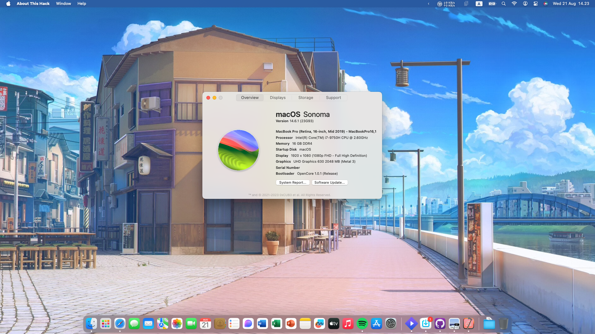

# Introduction
This is my personal documentation after successfully installing macOS Monterey, Ventura, and Sonoma on my MSI GS65 Stealth 9SD and use it as daily driver. This EFI is for the latest Sonoma version.

## Machine information
|Parts|Details
|:---:|:---:|
Model | MSI GS65 Stealth 9SD
CPU | Intel® Core™ i7-9750H Processor (2.60 GHz. up to 4.50 GHz. 12M Cache)
Intel Generation | Coffee Lake
RAM | 16GB (2x 8GB) DDR4
iGPU | Intel UHD Graphics 630
dGPU | NVIDIA GeForce GTX1660Ti 6GB (disabled as not supported by macOS)
Display | 15.6-inch FHD (1920×1080), 144Hz 100%sRGB
Wifi | Killer AC Wi-Fi
Bluetooth | Intel
Audio | Realtek ALC1220
SSD0 | ADATA XPG 512GB (purchased additionally, macOS installation and bootloader)
SSD1 | TOSHIBA 512GB (default from MSI, Windows 11 installation and bootloader)

## macOS Screenshot

## Bootloader information
OpenCore: 1.0.0

# What's Working
* CPU Power Management
* Graphics acceleration
* Display functions (Color, Brightness, etc)
* Wifi
* Bluetooth
* Trackpad (multitouch and gesture support)
* Keyboard
* USB Ports
* USB Type-C (and likely Thunderbolt too)
* Webcam
* Audio
* Mic
* Sleep/Wake
* iMessage, FaceTime

# What's Broken
* Nvidia GPU (Apple removed support for Nvidia GPU)
* HDMI (HDMI is connected to Nvidia GPU, since it's disabled then HDMI is not working)

# BIOS Settings
### Disable
- Fast Boot (disable - optional)
- Secure Boot
- Thunderbolt Boot Support
- Intel Bios Guard Support
- VT-d (can be enabled with quirk DisableIoMapper)
- CFG-Lock (Hidden Settings, press R-CTRL R-Shift L-ALT F2, if you can't disable CFG-Lock enable AppleXcpmCfgLock quirk)
### Enable
- Hyper-Threading
- XHCI Hand-off
- SATA Mode: AHCI

# Notes
* I highly recommend building your own files by following Dortania's excellent guide. it will help you understand the big picture and how to use my files correctly. After you went through all the guide, you can use my files as a reference.
* You need to generate your own SMBIOS, see Dortania's Guide. I spoof my device as MacBookPro16,1.
* If it somehow failed to boot with all my files, the problem is likely to be the DSDT.aml. DSDT is known to be unique to each devices. You will have to make your own DSDT and fix it with patches. I use SSDTTine by CorpNewt to create SSDT on Windows.

# Sources
### Opencore
[Opencore](https://github.com/acidanthera/OpenCorePkg)
### Kext
- [Lilu](https://github.com/acidanthera/Lilu)
- [VirtualSMC](https://github.com/acidanthera/VirtualSMC)
- [Graphics](https://github.com/acidanthera/WhateverGreen)
- [Audio](https://github.com/acidanthera/AppleALC)
- [Ethernet](https://github.com/Mieze/AtherosE2200Ethernet)
- [USB Mapping Tool](https://github.com/USBToolBox/tool)
- [USB Kext](https://github.com/USBToolBox/kext)
- [WiFi](https://github.com/OpenIntelWireless/itlwm)
- [Bluetooth](https://github.com/OpenIntelWireless/IntelBluetoothFirmware)
- [Keyboard & Trackpad](https://github.com/acidanthera/VoodooPS2)
- [NVMeFix](https://github.com/acidanthera/NVMeFix)
- [ECEnabler](https://github.com/1Revenger1/ECEnabler)
- [BrightnessKeys](https://github.com/acidanthera/BrightnessKeys)

# Credits
- [Dortania](https://dortania.github.io/OpenCore-Install-Guide) for amazing work in providing comprehensive guides
- [Acidanthera](https://github.com/acidanthera) for kext
- [CorpNewt](https://github.com/corpnewt)
- [RehabMan](https://github.com/RehabMan)
- [Mieze](https://github.com/Mieze)
- [Dhinak G](https://github.com/dhinakg)
- [Avery Black](https://github.com/1Revenger1)
- [lvs1974](https://github.com/lvs1974)

and many others that I have forgotten to include, sorry.
